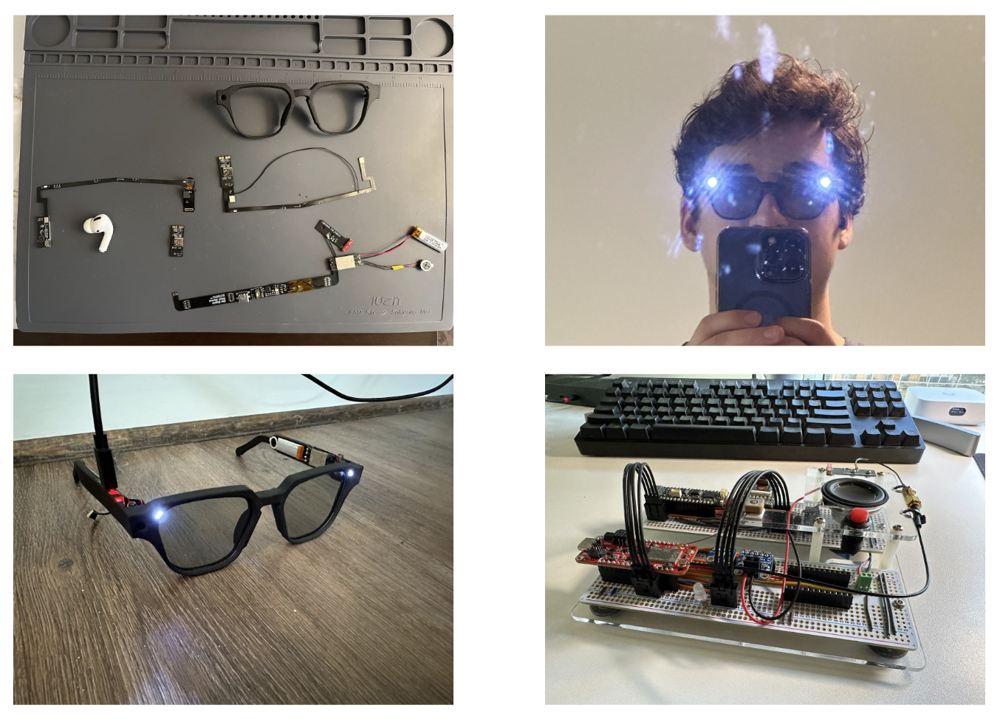

# Install / Running

1. Make sure you have node.js installed. I'm using node 21 (you can manage versions using node version manager)
2. Install dependencies with `npm i` in the project directory
3. Start the development server `npm start

# Questions

## Why did you choose the tools, libraries, and language you used for the coding exercise?

- I used node.js and express because I am familiar with using these tools to make a backend.
- I used TypeScript for it's type safety, on a larger codebase this really helps reduce errors that come with a dynamically typed language like JS.
- I used yup to validate request bodies as it works with TypeScript and because it produces useful error messages if request body malformed without a lot of set up.
- I mocked a database with a simple array and some helper functions since that was simplest for this challenge. Obviously not for production.

## What are the advantages and disadvantages of your solution?

### Advantages

- Well structured codebase
- Type checking with typescript
- Request body validation

### Disadvantages

- node.js isn't the fastest, could use something like Bun.
- The mock database isn't the most accurate representation of a real DB. For example, I just modify part of an object returned from `getTransactions()` to
  update it in the 'database'. A real DB wouldn't work like that.
- You shouldn't be able to "add" negative points in my opinion - but the example given in the instruction only passes if this is possible.

## What has been a favorite school/personal project thus far? What about it that challenged you?

I’ve always wanted to develop cool wearable AI applications. For example, a tool that would tell you the answer to a math problem just by looking at it, or an application that would tell you the odds of winning a hand in poker based on the cards it sees. However, all of the existing wearable hardware capable of hosting applications like this is either too bulky (like phones, VR headsets) or has completely locked-down software (like the Meta RayBan glasses).

I decided to build my own pair of smart glasses from the ground up that would let me completely control the hardware and software and run my own applications. I built large scale prototypes using off the shelf parts to prototype the hardware and firmware in order to evaluate the feasibility of my idea and refine my design before I committed to designing and producing custom hardware. Then, I designed circuit boards (using components smaller than those in phones in many cases!) and modeled an actual glasses frame which was sleek enough to look like a normal frame, and still able to fit all of the necessary electronic components. Along the way, I tried to make them better than the RayBans, too. The glasses I built have two speakers, microphone, camera, and Bluetooth, WiFi, GNSS, and Cellular along with two powerful lights that work like a headlamp. Everything is powered by an on board battery rechargeable using USB-C.

Since the glasses were too small to fit a processor capable of on-device AI applications, I developed a powerful server application which would use multimodal large language models to complete the requests from the user of the glasses. In operation, the glasses send a single request to the backend with the audio data (user speech), image data, and metadata. Then, the backend transcribes the audio, queries the LLM, updates the database with conversation context, then generates speech which the glasses play back to the user.

Overall, I was able to solve a problem I had, build a cool piece of hardware, and get better at electronics design and a variety of programming languages (real-time C, TypeScript, etc). This isn’t on my resume because it’s as much hardware as it is software, and because it’s hard to make ‘believable’ in a couple of bullet points.

